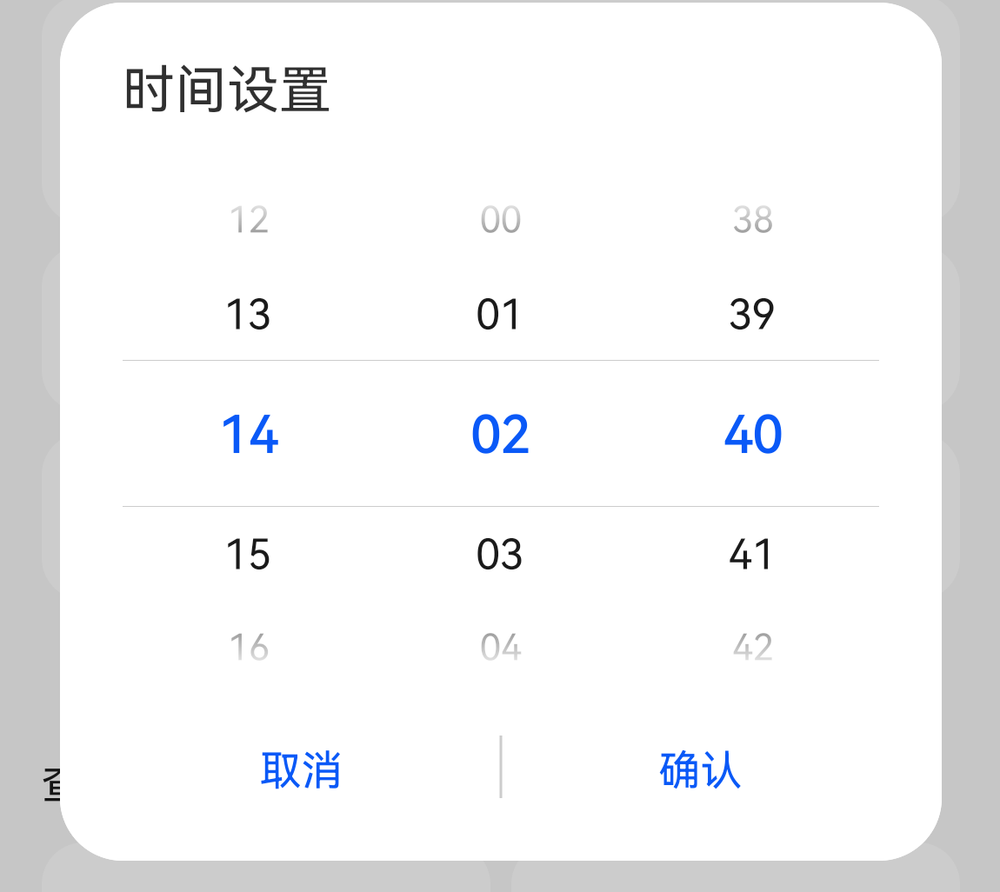

# 设备控制FA模板使用说明

<a href="#overview">**概述**</a>

<a href="#structure">**项目结构**</a>

<a href="#rendering">**效果图**</a>

<a href="#class">**JAVA类定义**</a>

<a href="#work_process">**模板工作流程**</a>

<a href="#using_manual">**模板使用步骤**</a>

<a href="#template">**配置文件字段说明**</a>

<a name="overview"></a>

## 概述

该模板可以由开发者通过声明json配置文件以及少量代码的编写来实现设备控制界面FA的开发。

json配置文件的详细字段定义见<a href="#manual">配置文件字段说明</a>


<a name="structure"></a>

## 项目结构

.
├─node_modules
│  └─ailife-view //该目录无需修改
│      ├─control //控件容器
│      │  ├─display //信息展示类控件
│      │  ├─enum //枚举类控件
│      │  ├─increasedecrease //加减器控件
│      │  ├─item //显示子元素
│      │  ├─multifunction //多功能控件
│      │  ├─progress //进度条控件
│      │  └─reversal //开关类控件
│      ├─customdisplay //自定义展示区
│      ├─dialog //弹窗容器
│      │  ├─dialogbox
│      │  ├─enumlist //枚举弹窗
│      │  ├─info //信息显示弹窗
│      │  ├─picker //选择器弹窗
│      │  └─radiolist //单选弹窗
│      ├─observed
│      └─utils
└─src
    └─main
        ├─java //该目录下内容可见<a href="#class">类定义</a>
        ├─js
        │  └─default
        │      ├─common //该目录下为本地资源文件，主要都是用于显示的图标资源
        │      │  └─LAMP
        │      │          ic_computer_nor.png
        │      │          ic_computer_nor_dark.png
        │      │          ...
        │      └─pages
        │          └─index
        │                  index.js //起始js
        └─resources
            └─rawfile
                ├─LAMP
                        LAMP_en.json //本地英文<a href="#template">模板配置文件</a>
                        LAMP_zh.json //本地中文<a href="#template">模板配置文件</a>


<a name="rendering"></a>

## 效果图


<a name="class"></a>

## JAVA类定义

| Class                       | Description                                                  |
| --------------------------- | ------------------------------------------------------------ |
| MyApplication               | 应用的入口类                                                 |
| MainAbility                 | 拉起js的入口类                                               |
| BaseDeviceDataHandler       | 与设备数据交互的抽象类                                       |
| HiLinkDeviceDataHandler     | 继承 BaseDeviceDataHandler 抽象类，实现与支持HiLink协议的设备数据交互，开发者无需修改 |
| ThirdPartyDeviceDataHandler | 继承 BaseDeviceDataHandler 抽象类，由开发者实现与自己服务器的数据交互，需要开发者修改 |
| SampleDeviceDataHandler     | 继承 BaseDeviceDataHandler 抽象类，示例代码，开发者无需修改  |
| DataHandlerAbility          | 与js交互的数据处理类                                         |


<a name="work_process"></a>

## 模板工作流程

1.读取模板配置文件：配置文件的路径需要在DataHandlerAbility中设置，文件来源可以是本地资源，也可以是从网络路径读取。

2.初始化数据：应用需要调用BaseDeviceDataHandler#initProfileData返回设备所有profile数据。

3.点击事件响应：事件触发后会调用到BaseDeviceDataHandler#modifyDeviceProperty，发送到设备端，此时ui不会有任何变化，直到BaseDeviceDataHandler#onDeviceDataChange被回调，此时应用需要将服务器上变化后的数据返回。

4.设备端的操作：在设备上操作后，应用必须触发BaseDeviceDataHandler#onDeviceDataChange回调来通知界面的刷新，此时应用需要将服务器上变化后的数据返回。

### 设备数据交互的抽象类BaseDeviceDataHandler 

* BaseDeviceDataHandler 
  * <a href="#BaseDeviceDataHandler_f">BaseDeviceDataHandler(deviceId, deviceDataCallback)</a>
  * <a href="#initProfileData">initProfileData(errorCode, errorMessage, dataMap)</a>
  * <a href="#modifyDeviceProperty">modifyDeviceProperty(key, value)</a>
  * <a href="#onDeviceDataChange">onDeviceDataChange(dataMap)</a>


<a name="using_manual"></a>

## 模板使用步骤

1、声明用于描述界面的json文件，json配置文件的详细字段定义见<a href="#manual">配置文件字段说明</a>，json文件可本地也可云化。

​      

2、提供UX资源图，可本地打包也可云化。

​      

3、修改模板代码中的json配置文件路径以及资源路径，支持本地或者云端路径。


4、指定设备的接入方式， 修改模板代码中的DataHandlerAbility#DEVICE_DATA_MODE， 我们提供两种设备接入的方式。

#### 	HiLink接入

1.将DataHandlerAbility#DEVICE_DATA_MODE设为DEVICE_DATA_MODE_HILINK。

2.HiLinkDeviceDataHandler已经完整实现了与设备之间的数据交互，开发者无需修改。

设备接入HiLink可以参考：https://developer.huawei.com/consumer/cn/smarthome

点击右上角查看更多，可以看到接入HiLink的提示信息。

​														

#### 	三方云接入

​	1.将DataHandlerAbility中DEVICE_DATA_MODE设为DEVICE_DATA_MODE_THIRD_PARTY。

​	2.开发者需要修改ThirdPartyDeviceDataHandler，填充与服务器交互的逻辑。应实现函数如下

​		①构造函数：应从云端获取设备的所有数据并调用initProfileData发送到js层。

​		②modifyDeviceProperty：界面点击事件后会触发回调该方法，应将变化的数据发送到云端。

​		③onDeviceChange：这个方法不需要覆写，云端监听到设备数据变化后应通过该方法传递变化数据到界面。


<a name="template"></a>

## 配置文件字段说明

模板配置文件为生成界面的主要依据

```
{
  "devName": "lamp",
  "devType": "0",
  "prodId": "LAMP",    -- productId指定了界面上的产品图和logo
  "templateUIInfo": [  -- templateUIInfo下面可以堆砌模板提供的控件，以行为单位。
    {"name": "power"...},
    {"name": "model"...},
    {"name": "brightness"...}
  ],
  "version": "0.1"
}
```


<a name="manual"></a>

### 控件配置说明

<a href="#display">**Dispaly控件**</a>

<a href="#enum">**ENUM控件**</a>

<a href="#reversal">**Reversal控件**</a>

<a href="#increase_decrease">**INCREASE_DECREASE控件**</a>

<a href="#progress">**Progress控件**</a>

<a href="#multifunction">**Multifunction控件**</a>

<a href="#dialog">**Dialog控件**</a>

<a name="display"></a>

**Display控件**


```
{
  "gravity": "default",
  "heightType": "default",
  "name": "电量",
  "span": 1,
  "uiList": [
    {
      "subType": "text",
      "textDisplay": {
        "down": {},
        "upLeft": {
          "description": {
            "path": "bluetoothConnectStatus/bluetoothConnectStatus",
            "value": [
              {
                "scope": "0",
                "target": "未连接"
              },
              {
                "scope": "1",
                "target": "已连接"
              }
            ]
          },
          "type": "dynamicText",
          "value": "${bluetoothConnectStatus/bluetoothConnectStatus}"
        },
        "upRight": {}
      }
    },
    {
      "icon": {
        "path": "infoDisplay/battery",
        "value": [
          {
            "defaultTarget ": "/template/pic/battery_10_default.png",
            "disableTarget ": "/template/pic/battery_10_default.png",
            "scope": "-10",
            "target": "/template/pic/battery_10_default.png"
          },
          {
            "defaultTarget ": "/template/pic/battery_20_default.png",
            "disableTarget ": "/template/pic/battery_20_default.png",
            "scope": "10-20",
            "target": "/template/pic/battery_20_default.png"
          },
          {
            "defaultTarget ": "/template/pic/battery_30_default.png",
            "disableTarget ": "/template/pic/battery_30_default.png",
            "scope": "20-30",
            "target": "/template/pic/battery_30_default.png"
          },
          {
            "defaultTarget ": "/template/pic/battery_40_default.png",
            "disableTarget ": "/template/pic/battery_40_default.png",
            "scope": "30-40",
            "target": "/template/pic/battery_40_default.png"
          },
          {
            "defaultTarget ": "/template/pic/battery_50_default.png",
            "disableTarget ": "/template/pic/battery_50_default.png",
            "scope": "40-50",
            "target": "/template/pic/battery_50_default.png"
          },
          {
            "defaultTarget ": "/template/pic/battery_60_default.png",
            "disableTarget ": "/template/pic/battery_60_default.png",
            "scope": "50-60",
            "target": "/template/pic/battery_60_default.png"
          },
          {
            "defaultTarget ": "/template/pic/battery_70_default.png",
            "disableTarget ": "/template/pic/battery_70_default.png",
            "scope": "60-70",
            "target": "/template/pic/battery_70_default.png"
          },
          {
            "defaultTarget ": "/template/pic/battery_80_default.png",
            "disableTarget ": "/template/pic/battery_80_default.png",
            "scope": "70-80",
            "target": "/template/pic/battery_80_default.png"
          },
          {
            "defaultTarget ": "/template/pic/battery_90_default.png",
            "disableTarget ": "/template/pic/battery_90_default.png",
            "scope": "80-90",
            "target": "/template/pic/battery_90_default.png"
          },
          {
            "defaultTarget ": "/template/pic/battery_99_default.png",
            "disableTarget ": "/template/pic/battery_99_default.png",
            "scope": "90-100",
            "target": "/template/pic/battery_99_default.png"
          },
          {
            "defaultTarget ": "/template/pic/battery_100_default.png",
            "disableTarget ": "/template/pic/battery_100_default.png",
            "scope": "100-",
            "target": "/template/pic/battery_100_default.png"
          }
        ]
      },
      "iconText": {
        "type": "dynamicText",
        "value": "${infoDisplay/battery}%",
        "range": "100-0"
      },
      "subType": "iconTextHorizontal"
    }
  ],
  "uiType": "DISPLAY"
}
```

相关的参数，定义如下：

| 字段名称   | 可选/必选 | 字段类型       | 字段描述         | 备注                                                         |
| :--------- | --------- | :------------- | :--------------- | ------------------------------------------------------------ |
| name       | 必选      | String (1-128) | 当前控件显示名称 | 例如：“电量”                                                 |
| span       | 必选      | float          | 跨度             | 根据普通手机设置控件的宽度占比，为1表示占满普通手机的宽。0.5表示占普通手机一半的宽。折叠屏，pad等参考数值根据实际UI要求计算 |
| uiType     | 必选      | String(1-128)  | 控件风格         | 控件风格为：“DISPLAY” ，“REVERSAL”,“INCREASE_DECREASE”，“ENUM” ，“MULTIFUNCTION” |
| heightType | 可选      | String(1-128)  | 高度类型         | “default”，“low”；默认为“default”                            |
| gravity    | 可选      | String(1-128)  | 子视图位置样式   | 样式分为：”default”,” center”，“centerDivider”。默认为“default”，位置样式为俩边靠，无分隔线。” center”为等分居中，” centerDivider”为等分居中且带分隔线。 |
| uiList     | 必选      | DisplayItem[]  | 子视图列表       | 子视图列表，具体根据实际显示需要配置对应个数的显示控件       |

DisplayItem

| **字段名称** | 可选/必选 | **字段类型**           | **字段描述**                                                 | **备注**                                                     |
| ------------ | --------- | ---------------------- | ------------------------------------------------------------ | ------------------------------------------------------------ |
| subType      | 必选      | String(1-128)          | 子类型                                                       | 纯文本，图标，图标+文本“text”，“icon”，“iconTextVertical”, “iconTextHorizontal” |
| icon         | 可选      | DynamicContent         | 动态颜色、图标，文本，根据path路径下数据的范围动态匹配对应的值。同时写icon和text时，形成icon上，文字下的上下结构 | "icon": {<br>    "defaultIcon":  "", <br>    "path":  "battery/useDay",<br>    "disableIcon":  "",<br>    "value": [ <br/>        {<br/>            "scope":  "-50",<br/>            "target":  "" <br/>        }, <br/>        {<br/>            "scope":  "50-100", <br/>            "target":  "" <br/>        }, <br/>        { <br/>                "scope":  "100-", <br/>                "target":  ""<br/>        }<br/>    ]<br/>} |
| iconText     | 可选      | NormalText/DynamicText | 图标描述文本                                                 | "iconText":{<br/>    "color": "",<br/>    "type":  "normalText",<br/>    "value":  "手动"<br/>} |
| textDisplay  | 可选      | DiaplayContent         | 文字模板，分为上左，上右和下。3处文字根据实际需求填写，分为普通文本类型NormalText和动态文本类型DynamicText | "textDisplay": {<br/>    "down": {<br/>    "color":  "11FCFC",<br/>    "type":  "normalText",<br/>    "value": "刷头可用>"<br/>    },<br/>    "upLeft": {<br/>        "color": {<br/>            "path":"battery/useDay",<br/>            "value": [<br/>                {<br/>                    "scope": "-50",<br/>                    "target": "11FCFC"<br/>                },<br/>                {<br/>                    "scope": "50-100",<br/>                    "target":  "22FCFC"<br/>                },<br/>                {<br/>                    "scope": "100-",<br/>                    "target": "33FCFC"<br/>                }<br/>            ]<br/>        },<br/>        "ratio": 1,<br/>         "type":  "dynamicText",<br>        "value":"${battery/useDay}"<br/>    },<br/>    "upRight": {<br/>        "color":  "",<br/>        "type":  "normalText",<br/>        "value": "天"<br/>    }<br/>} |

DynamicContent

| 字段名称 | 可选/必选 | 字段类型        | 字段描述                                     | 备注                                                      |
| -------- | --------- | --------------- | -------------------------------------------- | --------------------------------------------------------- |
| path     | 必选      | String  (1-128) | 动态内容条件值，可能需要动态获取设备数据填充 | 例如：“pm2p5/pm2p5Value” ，表示当前设备上报PM2.5的值      |
| value    | 必选      | Variation       | 动态范围值                                   | {<br>    "scope": "-50",<br/>    "target": "11FCFC"<br/>} |

Variation

| 字段名称      | 可选/必选 | 字段类型        | 字段描述      | 备注                                                         |
| ------------- | --------- | --------------- | ------------- | ------------------------------------------------------------ |
| scope         | 必选      | String  (1-128) | 条件范围      | 用“-”区分范围，有三种类型：  1，-50：表示小于等于50的值  2，50-100；表示大于50小于等于100；  3，100-：表示大于100的值  4，"scope": "-"时，表示可以匹配任意场景。  5，50：表示等于50 |
| target        | 必选      | String (1-128)  | 条件对应的值  | 可能是颜色值，资源值等，例如："11FCFC"，图标url              |
| defaultTarget | 可选      | String  (1-128) | 默认图标url   | 默认图标url                                                  |
| disableTarget | 可选      | String  (1-128) | 不可用图标url | 不可用图标url                                                |

NormalText

| 字段名称 | 可选/必选 | 字段类型        | 字段描述                 | 备注                               |
| -------- | --------- | --------------- | ------------------------ | ---------------------------------- |
| type     | 必选      | String  (1-128) | 类型字段                 | 固定为NormalText                   |
| value    | 必选      | String  (1-128) | 当前控件显示名称         | 固定写死的值，例如："value":  "天" |
| color    | 可选      | String  (1-128) | 当前控件显示颜色，固定值 | 固定写死的值，例如："11FCFC"       |

DynamicText

| 字段名称    | 可选/必选 | 字段类型        | 字段描述                 | 备注                                                         |
| ----------- | --------- | --------------- | ------------------------ | ------------------------------------------------------------ |
| type        | 必选      | String  (1-128) | 类型字段                 | 固定为DynamicText                                            |
| value       | 必选      | String  (1-128) | 当前控件显示名称         | 例如：“${pm2p5/pm2p5Value}”注意：此处**${}**表示占位符，内部数据需要根据设备上报结果进行动态匹配 |
| ratio       | 可选      | float           | 补偿因子                 | 例如：空气净化器检测PM2.5为500微克，实际页面上显示单位为毫克，显示内容为0.5，那么补偿因子为0.001，再选中页面数值后，控制的过程中，要再次除以补偿因子，进行命令下发。 |
| range       | 可选      | int             | 取值范围                 | "range":  "100-0"  蓝牙设备设置取值范围，在半模态初始化时，无兜底数据的情况下，做数据变动，范围为range的范围，顺序为range的前值变动到后值，然后反转，如此循环 |
| priority    | 可选      | String  (1-128) | 蓝牙设备数据来源         | 蓝牙设备数据来源分为：”default”,” cloud”，不写该字段默认为default，default表示先用数据库的数据（云端读取存储）做兜底展示，后用蓝牙数据替代。Cloud表示只用数据库的数据（云端读取存储）做展示。 |
| color       | 可选      | DynamicContent  | 当前控件显示颜色，动态值 | "color": {<br/>    "path":"battery/useDay",<br/>    "value": [<br/>        {<br/>            "scope": "-50",<br/>            "target": "11FCFC"<br/>        },<br/>        {<br/>            "scope": "50-100",<br/>            "target": "22FCFC"<br/>        },<br/>        {<br/>            "scope": "100-",<br/>            "target": "33FCFC"<br/>        }<br/>    ]<br/>} |
| description | 可选      | DynamicContent  | 当前控件描述转换，动态值 | "description": {<br/>    "path": "pm2p5/pm2p5Value",<br/>    "value": [<br/>        {<br/>            "scope": "-50",<br/>            "target": "优 "<br/>        },<br/>        {<br/>            "scope": "60-90",<br/>            "target": "良 "<br/>         },<br/>        {<br/>            "scope": "100-",<br/>            "target": "差 "<br/>        }<br/>    ]<br/>} |


INCREASE_DECREASE控件<a name="enum"></a>

**Enum控件**


```
{
      "gravity": "centerDivider",
      "heightType": "default",
      "name": "模式",
      "span": 1,
      "command": [
        {
          "characteristic": "mode",
          "enumInfo": [
            {
              "displayItem":{
                "icon": {
                  "path": "lightMode/mode",
                  "value": [
                    {
                      "defaultTarget": "/ic_read_nor.png",
                      "scope": "-",
                      "target": "/ic_read_on.png"
                    }
                  ],
                  "valueNight": [
                    {
                      "defaultTarget": "/ic_read_nor_dark.png",
                      "scope": "-",
                      "target": "/ic_read_on_dark.png"
                    }
                  ]
                },
                "iconText": {
                  "type": "normalText",
                  "value": "阅读"
                },
                "subType": "iconTextVertical"
              },
              "value": 2
            },
            {
              "displayItem": {
                "icon": {
                  "path": "lightMode/mode",
                  "value": [
                    {
                      "defaultTarget": "/ic_write_nor.png",
                      "scope": "-",
                      "target": "/ic_write_on.png"
                    }
                  ],
                  "valueNight": [
                    {
                      "defaultTarget": "/ic_write_nor_dark.png",
                      "scope": "-",
                      "target": "/ic_write_on_dark.png"
                    }
                  ]
                },
                "iconText": {
                  "type": "normalText",
                  "value": "书写"
                },
                "subType": "iconTextVertical"
              },
              "value": 3
            },
            {
              "displayItem": {
                "icon": {
                  "path": "lightMode/mode",
                  "value": [
                    {
                      "defaultTarget": "/ic_computer_nor.png",
                      "scope": "-",
                      "target": "/ic_computer_on.png"
                    }
                  ],
                  "valueNight": [
                    {
                      "defaultTarget": "/ic_computer_nor_dark.png",
                      "scope": "-",
                      "target": "/ic_computer_on_dark.png"
                    }
                  ]
                },
                "iconText": {
                  "type": "normalText",
                  "value": "电脑"
                },
                "subType": "iconTextVertical"
              },
              "value": 4
            },
            {
              "displayItem": {
                "icon": {
                  "path": "lightMode/mode",
                  "value": [
                    {
                      "defaultTarget": "/ic_favorite_nor.png",
                      "scope": "-",
                      "target": "/ic_favorite_on.png"
                    }
                  ],
                  "valueNight": [
                    {
                      "defaultTarget": "/ic_favorite_nor_dark.png",
                      "scope": "-",
                      "target": "/ic_favorite_on_dark.png"
                    }
                  ]
                },
                "iconText": {
                  "type": "normalText",
                  "value": "最爱"
                },
                "subType": "iconTextVertical"
              },
              "value": 5
            }
          ],
          "sid": "lightMode"
        }
      ],
      "uiType": "ENUM"
    }
```

相关的参数，定义如下：

| 字段名称   | 可选/必选 | 字段类型       | 字段描述           | 备注                                                         |
| ---------- | --------- | -------------- | ------------------ | ------------------------------------------------------------ |
| name       | 必选      | String (1-128) | 当前控件显示名称   | 例如：“亮度”                                                 |
| span       | 必选      | float          | 跨度               | 根据普通手机设置控件的宽度占比，为1表示占满普通手机的宽。0.5表示占普通手机一半的宽。折叠屏，pad等参考数值根据实际UI要求计算 |
| uiType     | 必选      | String(1-128)  | 控件风格           | 控件风格为：“DISPLAY” ，“REVERSAL”,“INCREASE_DECREASE”，“ENUM” ，“MULTIFUNCTION” |
| tag        | 可选      | String(1-128)  | 标记               | 扩展字段，用作标记特殊控件处理                               |
| heightType | 可选      | String(1-128)  | 高度类型           | “default”，“low”；默认为“default”                            |
| command    | 必选      | Command[]      | 控件对应的动作数组 | ACTION_NORMAL在前面，ACTION_ENUM在后面，下发命令为串行下发，先发完所有的ACTION_NORMAL再发ACTION_ENUM |
| gravity    | 可选      | String(1-128)  | 子视图位置样式     | 样式分为：”default”,” center”，“centerDivider”。默认为“default”，位置样式为俩边靠，无分隔线。” center”为等分居中，” centerDivider”为等分居中且带分隔线。 |

NormalCommand

| 字段名称       | 可选/必选 | 字段类型       | 字段描述       | 备注              |
| -------------- | --------- | -------------- | -------------- | ----------------- |
| sid            | 必选      | String  (1-32) | 命令对应的服务 | 例如：“lightMode” |
| characteristic | 必选      | String  (1-32) | 命令对应的属性 | 例如：“mode”      |
| value          | 必选      | int            | 下发命令值     | 例如："value": 1  |

EnumCommand

| 字段名称       | 可选/必选 | 字段类型       | 字段描述       | 备注              |
| -------------- | --------- | -------------- | -------------- | ----------------- |
| sid            | 必选      | String  (1-32) | 命令对应的服务 | 例如：“lightMode” |
| characteristic | 必选      | String  (1-32) | 命令对应的属性 | 例如：“mode”      |
| value          | 必选      | int            | 下发命令值     | 例如："value": 1  |

EnumInfo

| 字段名称    | 可选/必选 | 字段类型    | 字段描述                 | 备注                                                         |
| ----------- | --------- | ----------- | ------------------------ | ------------------------------------------------------------ |
| displayItem | 可选      | DisplayItem | 通用展示子视图           | 通用展示子视图                                               |
| value       | 必选      | int         | 命令对应的服务属性值     | 例如：4                                                      |
| disable     | 可选      | String[]    | 命令触发后禁用的标签数组 | 例如：["模式",  "亮度"]，类似手机版本智慧生活App的属性禁用联动，例如：空气净化器关闭的时候，禁用睡眠模式。 |


<a name="reversal"></a>

**Reversal控件**


```
{
      "gravity": "default",
      "heightType": "default",
      "name": "电源",
      "span": 1,
      "command": [
        {
          "characteristic": "on",
          "reversal": [
            {
              "disableIcon": "/ic_power_nor.png",
              "icon": "/ic_on.png",
              "disableIconNight": "/ic_power_nor_dark.png",
              "iconNight": "/ic_on_dark.png",
              "value": 1
            },
            {
              "disable": {
                "name": [
                  "模式",
                  "亮度"
                ]
              },
              "disableIcon": "/ic_power_nor.png",
              "icon": "/ic_off.png",
              "disableIconNight": "/ic_power_nor_dark.png",
              "iconNight": "/ic_off_dark.png",
              "value": 0
            }
          ],
          "sid": "switch"
        }
      ],
      "displayItemOne": {
        "subType": "text",
        "textDisplay": {
          "down": {},
          "upLeft": {
            "description": {
              "path": "switch/on",
              "value": [
                {
                  "scope": "0",
                  "target": "已关闭"
                },
                {
                  "scope": "1",
                  "target": "已开启"
                }
              ]
            },
            "type": "dynamicText",
            "value": "${switch/on}"
          },
          "upRight": {}
        }
      },
      "uiType": "REVERSAL"
    }
```

相关的参数，定义如下：

| 字段名称       | 可选/必选 | 字段类型          | 字段描述           | 备注                                                         |
| -------------- | --------- | ----------------- | ------------------ | ------------------------------------------------------------ |
| name           | 必选      | String (1-128)    | 当前控件显示名称   | 例如：“Battery”                                              |
| span           | 必选      | float             | 跨度               | 根据普通手机设置控件的宽度占比，为1表示占满普通手机的宽。0.5表示占普通手机一半的宽。折叠屏，pad等参考数值根据实际UI要求计算 |
| uiType         | 必选      | String(1-128)     | 控件风格           | 控件风格为：“DISPLAY” ，“REVERSAL”,“INCREASE_DECREASE”，“ENUM” ，“MULTIFUNCTION” |
| tag            | 可选      | String(1-128)     | 标记               | 扩展字段，用作标记特殊控件处理                               |
| heightType     | 可选      | String(1-128)     | 高度类型           | “default”，“low”；默认为“default”                            |
| displayItemOne | 必选      | DisplayItem       | 通用展示子视图     | 排第一个的展示视图                                           |
| displayItemTwo | 可选      | DisplayItem       | 通用展示子视图     | 可选，用于一排显示3个的情况，前俩个显示通用视图，第3个为反转开关 |
| command        | 必选      | ReversalCommand[] | 控件对应的动作数组 |                                                              |
| gravity        | 可选      | String(1-128)     | 子视图位置样式     | 样式分为：”default”,” center”，“centerDivider”。默认为“default”，位置样式为俩边靠，无分隔线。” center”为等分居中，” centerDivider”为等分居中且带分隔线。 |

ReversalCommand

| 字段名称       | 可选/必选 | 字段类型      | 字段描述       | 备注                                                      |
| -------------- | --------- | ------------- | -------------- | --------------------------------------------------------- |
| sid            | 必选      | String (1-32) | 命令对应的服务 | 例如：“switch”                                            |
| characteristic | 必选      | String (1-32) | 命令对应的属性 | 例如：“on”                                                |
| reversal       | 必选      | Reversal[]    | 反转命令属性   | 数组，对应switch/on的不同属性值，控制的时候，可以相互切换 |

Reversal

| 字段名称    | 可选/必选 | 字段类型       | 字段描述                 | 备注                                                         |
| ----------- | --------- | -------------- | ------------------------ | ------------------------------------------------------------ |
| value       | 可选      | int            | 命令下发对应的属性值     | value和valueString二者存在其一。其中wifi设备使用value，蓝牙设备使用value或者valueString。 |
| valueString | 可选      | String (1-128) | 命令下发对应的属性值     | value和valueString二者存在其一。其中wifi设备使用value，蓝牙设备使用value或者valueString。 |
| icon        | 必选      | String (1-128) | 命令对应的图像标签       | 命令对应的图标url                                            |
| disableIcon | 可选      | String (1-128) | 不可用图标url            | 不可用图标url                                                |
| disable     | 可选      | String[]       | 命令触发后禁用的标签数组 | 例如：["模式",  "亮度"]，类似手机版本智慧生活App的属性禁用联动，例如：空气净化器关闭的时候，禁用睡眠模式。 |

Property

| 字段名称 | 可选/必选 | 字段类型       | 字段描述 | 备注                                              |
| -------- | --------- | -------------- | -------- | ------------------------------------------------- |
| path     | 必选      | String  (1-32) | 属性路径 | 例如："switch/on"，其中switch表示服务，on表示属性 |
| value    | 必选      | String  (1-32) | 属性值   | 例如：1                                           |


<a name="increase_decrease"></a>

**INCREASE_DECREASE控件**


```
{
  "name": "温度",
  "span": 1,
  "gravity": "default",
  "uiType": "INCREASE_DECREASE",
  "heightType": "low",
  "displayItem": {
    "subType": "text",
    "textDisplay": {
      "down": {},
      "upLeft": {
        "type": "normalText",
        "value": "温度"
      },
      "upRight": {}
    }
  },
  "command": [
    {
      "sid": "temperature",
      "characteristic": "temperature",
      "max": 36,
      "min": 17,
      "ratio": 1,
      "step": 1,
      "defaultValue": 26,
      "disableIconDecrease": "",
      "iconDecrease": "",
      "disableIconIncrease": "",
      "iconIncrease": ""
    }
  ]
}
```

相关的参数，定义如下：

| 字段名称    | 可选/必选 | 字段类型       | 字段描述           | 备注                                                         |
| ----------- | --------- | -------------- | ------------------ | ------------------------------------------------------------ |
| name        | 必选      | String (1-128) | 当前控件显示名称   | 例如：“亮度”                                                 |
| span        | 必选      | float          | 跨度               | 根据普通手机设置控件的宽度占比，为1表示占满普通手机的宽。0.5表示占普通手机一半的宽。折叠屏，pad等参考数值根据实际UI要求计算 |
| uiType      | 必选      | String(1-128)  | 控件风格           | 控件风格为：“DISPLAY” ，“REVERSAL”,“INCREASE_DECREASE”，“ENUM” ，“MULTIFUNCTION” |
| tag         | 可选      | String(1-128)  | 标记               | 扩展字段，用作标记特殊控件处理                               |
| heightType  | 可选      | String(1-128)  | 高度类型           | “default”，“low”；默认为“default”                            |
| displayItem | 可选      | DisplayItem    | 通用展示子视图     | 中间的展示视图                                               |
| command     | 必选      | Command[]      | 控件对应的动作数组 |                                                              |
| gravity     | 可选      | String(1-128)  | 子视图位置样式     | 样式分为：”default”,” center”，“centerDivider”。默认为“default”，位置样式为俩边靠，无分隔线。” center”为等分居中，” centerDivider”为等分居中且带分隔线。 |

IncreaseDecreaseCommand

| 字段名称            | 可选/必选 | 字段类型       | 字段描述                 | 备注                                                         |
| ------------------- | --------- | -------------- | ------------------------ | ------------------------------------------------------------ |
| sid                 | 必选      | String  (1-32) | 命令对应的服务           | 例如：“brightness”                                           |
| characteristic      | 必选      | String  (1-32) | 命令对应的属性           | 例如：“brightness”                                           |
| max                 | 必选      | int            | 范围最大值               | 例如：亮度最大值为100                                        |
| min                 | 必选      | int            | 范围最小值               | 例如：亮度最大值为0                                          |
| ratio               | 可选      | float          | 补偿因子                 | 例如：空气净化器检测PM2.5为500微克，实际页面上显示单位为毫克，显示内容为0.5，那么补偿因子为0.001，再选中页面数值后，控制的过程中，要再次除以补偿因子，进行命令下发。 |
| step                | 必选      | int            | 步进值                   | 每次变化的值                                                 |
| iconDecrease        | 必选      | String         | 减少的图标               | 减少的图标                                                   |
| disableIconDecrease | 必选      | String         | 减少的不可用图标         | 减少的不可用图标                                             |
| iconIncrease        | 必选      | String         | 增加的图标               | 增加的图标                                                   |
| disableIconIncrease | 必选      | String         | 增加的不可用图标         | 增加的不可用图标                                             |
| defaultValue        | 可选      | int            | 默认值                   |                                                              |
| disable             | 可选      | String[]       | 命令触发后禁用的标签数组 | 例如：["模式",  "亮度"]，类似手机版本智慧生活App的属性禁用联动，例如：空气净化器关闭的时候，禁用睡眠模式。 |


<a name="progress"></a>

**Progress控件**


```
{
      "gravity": "default",
      "heightType": "low",
      "name": "亮度",
      "span": 1,
      "command": [
        {
          "characteristic": "brightness",
          "defaultValue": 100,
          "max" : 255,
          "min": 0,
          "radio" : 1,
          "sid": "brightness"
        }
      ],
      "displayItemLeft": {
        "subType": "text",
        "textDisplay": {
          "down": {
            "color": {
              "path" : "brightness/brightness",
              "value" : [{
                "scope": "-",
                "target": "007DFF"
              }]
            },
            "ratio": "0.392156",
            "type": "dynamicText",
            "value": "${brightness/brightness}%"
          },
          "upLeft": {
            "type": "normalText",
            "value": "亮度"
          },
          "upRight": {}
        }
      },
      "uiType": "PROGRESS"
    }
```

相关的参数，定义如下：

| 字段名称    | 可选/必选 | 字段类型       | 字段描述           | 备注                                                         |
| ----------- | --------- | -------------- | ------------------ | ------------------------------------------------------------ |
| name        | 必选      | String (1-128) | 当前控件显示名称   | 例如：“亮度”                                                 |
| span        | 必选      | float          | 跨度               | 根据普通手机设置控件的宽度占比，为1表示占满普通手机的宽。0.5表示占普通手机一半的宽。折叠屏，pad等参考数值根据实际UI要求计算 |
| uiType      | 必选      | String(1-128)  | 控件风格           | 控件风格为：“DISPLAY” ，“REVERSAL”,“INCREASE_DECREASE”，“ENUM” ，“MULTIFUNCTION” |
| tag         | 可选      | String(1-128)  | 标记               | 扩展字段，用作标记特殊控件处理                               |
| heightType  | 可选      | String(1-128)  | 高度类型           | “default”，“low”；默认为“default”                            |
| displayItem | 可选      | DisplayItem    | 通用展示子视图     | 中间的展示视图                                               |
| command     | 必选      | Command[]      | 控件对应的动作数组 |                                                              |


<a name="multifunction"></a>

**MultiFunction控件**


```
{
      "name": "制作",
      "span": 1,
      "uiType": "MULTIFUNCTION",
      "displayItemOne": {
        "subType":"text",
        "textDisplay": {
          "down": {},
          "upLeft": {
            "description": {
              "path": "workingStatus/status",
              "value": [
                {
                  "scope": "1",
                  "target": "待机中"
                },
                {
                  "scope": "2",
                  "target": "准备中"
                },
                {
                  "scope": "3",
                  "target": "制作中"
                },
                {
                  "scope": "4",
                  "target": "制作完成"
                },
                {
                  "scope": "5",
                  "target": "预约中"
                }
              ]
            },
            "type": "dynamicText",
            "value": "${workingStatus/status}"
          },
          "upRight": {}
        }
      },
      "displayItemTwo": {
        "subType":"text",
        "textDisplay":{
          "down":{
            "type":"normaltext",
            "value":"剩余时间"
          },
          "upLeft":{
            "type":"dynamicText",
            "value":"${remainingTime/time}"
          },
          "upRight":{

          }
        }
      },
      "multifunctionInfo": {
        "path": "workingStatus/action",
        "value": [
          {
            "scope": "1",
            "commandOne": [
              {
                "characteristic": "action",
                "disableIcon": "/ic_prepare.png",
                "icon": "/ic_prepare.png",
                "disableIconNight": "/ic_prepare.png",
                "iconNight": "/ic_prepare.png",
                "value": 3,
                "sid": "workingStatus"
              }
            ]
          },
          {
            "scope": "2",
            "commandOne": [
              {
                "characteristic": "action",
                "disableIcon": "/ic_prepare.png",
                "icon": "/ic_prepare.png",
                "disableIconNight": "/ic_prepare.png",
                "iconNight": "/ic_prepare.png",
                "value": 3,
                "sid": "workingStatus"
              }
            ],
            "commandTwo": [
              {
                "characteristic": "action",
                "disableIcon": "/ic_cancel.png",
                "icon": "/ic_cancel.png",
                "disableIconNight": "/ic_cancel.png",
                "iconNight": "/ic_cancel.png",
                "value": 0,
                "sid": "workingStatus"
              }
            ]
          },
          {
            "scope": "3",
            "commandOne": [
              {
                "characteristic": "action",
                "disableIcon": "/ic_cancel.png",
                "icon": "/ic_cancel.png",
                "disableIconNight": "/ic_cancel.png",
                "iconNight": "/ic_cancel.png",
                "value": 0,
                "sid": "workingStatus"
              }
            ]
          },
          {
            "scope": "4",
            "commandOne": [
              {
                "characteristic": "action",
                "disableIcon": "/ic_complete.png",
                "icon": "/ic_complete.png",
                "disableIconNight": "/ic_complete.png",
                "iconNight": "/ic_complete.png",
                "value": 0,
                "sid": "workingStatus"
              }
            ]
          },
          {
            "scope": "5",
            "commandOne": [
              {
                "characteristic": "action",
                "disableIcon": "/ic_cancel.png",
                "icon": "/ic_cancel.png",
                "disableIconNight": "/ic_cancel.png",
                "iconNight": "/ic_cancel.png",
                "value": 0,
                "sid": "workingStatus"
              }
            ]
          }
        ]
      }
    }
```

相关的参数，定义如下：

| 字段名称          | 可选/必选 | 字段类型              | 字段描述         | 备注                                                         |
| ----------------- | --------- | --------------------- | ---------------- | ------------------------------------------------------------ |
| name              | 必选      | String (1-128)        | 当前控件显示名称 | 例如：“Battery”                                              |
| span              | 必选      | float                 | 跨度             | 根据普通手机设置控件的宽度占比，为1表示占满普通手机的宽。0.5表示占普通手机一半的宽。折叠屏，pad等参考数值根据实际UI要求计算 |
| uiType            | 必选      | String(1-128)         | 控件风格         | 控件风格为：“DISPLAY” ，“REVERSAL”,“INCREASE_DECREASE”，“ENUM” ，“MULTIFUNCTION” |
| heightType        | 可选      | String(1-128)         | 高度类型         | “default”，“low”；默认为“default”                            |
| displayItemOne    | 必选      | DisplayItem           | 通用展示子视图   | 排第一个的展示视图                                           |
| displayItemTwo    | 可选      | DisplayItem           | 通用展示子视图   | 可选，用于一排显示3个的情况，前俩个显示通用视图，第3个为多功能按钮 |
| multifunctionInfo | 必选      | DynamicCommandContent | 多功能按钮       |                                                              |

DynamicCommandContent

| 字段名称 | 可选/必选 | 字段类型         | 字段描述                                     | 备注                                                 |
| -------- | --------- | ---------------- | -------------------------------------------- | ---------------------------------------------------- |
| path     | 必选      | String  (1-128)  | 动态内容条件值，可能需要动态获取设备数据填充 | 例如：“pm2p5/pm2p5Value” ，表示当前设备上报PM2.5的值 |
| value    | 必选      | VariationCommand | 动态范围值                                   | {      "scope": "-50",       "target": "11FCFC"  }   |

VariationCommand

| 字段名称   | 可选/必选 | 字段类型             | 字段描述  | 备注                                                         |
| ---------- | --------- | -------------------- | --------- | ------------------------------------------------------------ |
| scope      | 必选      | String  (1-128)      | 条件范围  | 用“-”区分范围，有三种类型：  1，-50：表示小于等于50的值  2，50-100；表示大于50小于等于100；  3，100-：表示大于100的值  4，"scope": "-"时，表示可以匹配任意场景。  5，50：表示等于50 |
| commandOne | 必选      | MultifunctionCommand | 执行动作1 | {<br/>    "characteristic":  "action",<br/>    "disableIcon":  "icon_start_dis.png",<br/>    "icon":  "icon_start.png",<br/>    "value":  1,<br/>    "sid":  "action"<br/>} |
| commandTwo | 可选      | MultifunctionCommand | 执行动作2 | {<br/>    "characteristic":  "action", <br/>    "disableIcon":  "icon_start_dis.png",<br/>    "icon":  "icon_start.png",<br/>    "value":  1,<br/>    "sid":  "action"<br/>} |

MultifunctionCommand

| 字段名称       | 可选/必选 | 字段类型       | 字段描述                 | 备注                                                         |
| -------------- | --------- | -------------- | ------------------------ | ------------------------------------------------------------ |
| sid            | 必选      | String (1-32)  | 命令对应的服务           | 例如：“switch”                                               |
| characteristic | 必选      | String (1-32)  | 命令对应的属性           | 例如：“on”                                                   |
| value          | 可选      | int            | 命令下发对应的属性值     | value和valueString二者存在其一。其中wifi设备使用value，蓝牙设备使用value或者valueString。 |
| valueString    | 可选      | String (1-128) | 命令下发对应的属性值     | value和valueString二者存在其一。其中wifi设备使用value，蓝牙设备使用value或者valueString。 |
| icon           | 必选      | String (1-128) | 命令对应的图像标签       | 命令对应的图标url                                            |
| disableIcon    | 可选      | String (1-128) | 不可用图标url            | 不可用图标url                                                |
| disable        | 可选      | String[]       | 命令触发后禁用的标签数组 | 例如：["模式",  "亮度"]，类似手机版本智慧生活App的属性禁用联动，例如：空气净化器关闭的时候，禁用睡眠模式。 |

<a name="dialog"></a>

### Dialog控件

<a href="#dialog_enum">**枚举类型**</a>

<a href="#dialog_radio">**单选类型**</a>

<a href="#dialog_info">**展示类型**</a>

<a href="#dialog_text">**文本选择器类型**</a>

<a href="#dialog_time">**时间选择器类型**</a>

<a href="#dialog_date">**日期选择器类型**</a>

<a href="#dialog_datetime">**日期时间选择器类型**</a>

<a href="#dialog_multi_text">**多列文本选择器类型**</a>

<a name="dialog_enum"></a>

**枚举类型**


```
{
      "name": "饮功能选择",
      "id": "drinkKind",
      "path": "drinkKind",
      "dialogType": "ENUM",
      "controlItems": [
        {
          "name": "取消",
          "type": "cancel"
        },
        {
          "name": "下一步",
          "type": "submit"
        }
      ],
      "command": [
        {
          "name": "五谷",
          "icon": {
            "value": {
              "defaultTarget": "/ic_wugu_nor.png",
              "target": "/ic_wugu_on.png"
            },
            "valueNight": {
              "defaultTarget": "/ic_wugu_nor.png",
              "target": "/ic_wugu_on.png"
            }
          },
          "dialogList": ["duration", "temperature", "capacity", "speed"],
          "value": 1
        },
        {
          "name": "豆浆",
          "icon": {
            "value": {
              "defaultTarget": "/ic_doujiang_nor.png",
              "target": "/ic_doujiang_on.png"
            },
            "valueNight": {
              "defaultTarget": "/ic_doujiang_nor.png",
              "target": "/ic_doujiang_on.png"
            }
          },
          "dialogList": ["duration", "temperature", "capacity", "speed"],
          "value": 2
        }
      ]
    }
```

相关的参数，定义如下：

| 字段名称     | 可选/必选 | 字段类型        | 字段描述           | 备注                                          |
| ------------ | --------- | --------------- | ------------------ | --------------------------------------------- |
| name         | 必选      | String（1-128） | 当前弹框显示名称   | 例如：“饮功能选择”                            |
| id           | 必选      | String（1-128） | 弹框唯一标识       | 例如：“drinkKind”                             |
| path         | 必选      | String（1-128） | 动态内容条件值     | 例如：“drinkKind”                             |
| dialogType   | 必选      | String（1-128） | 弹框类型           | 弹框类型为：“RADIO”，“ENUM”，“PICKER”，“INFO” |
| controlItems | 必选      | ControlItems[]  | 弹框底部控制项     |                                               |
| command      | 必选      | Command[]       | 弹框对应的动作数组 |                                               |

ControlItems

| 字段名称 | 可选/必选 | 字段类型        | 字段描述       | 备注                             |
| -------- | --------- | --------------- | -------------- | -------------------------------- |
| name     | 必选      | String（1-128） | 控制项显示名称 | 例如：“取消”                     |
| type     | 必选      | String（1-128） | 控制项类型     | 控制项类型为：“submit”，“cancel” |

Command

| 字段名称                      | 可选/必选 | 字段类型        | 字段描述                | 备注                         |
| ----------------------------- | --------- | --------------- | ----------------------- | ---------------------------- |
| name                          | 必选      | String（1-128） | 显示名称                | 例如：“五谷”                 |
| icon.value.defaultTarget      | 必选      | String（1-128） | 默认图标url             | 例如：“/ic_doujiang_nor.png” |
| icon.value.target             | 必选      | String（1-128） | 点击状态图标url         | 例如：“/ic_doujiang_on.png”  |
| icon.valueNight.defaultTarget | 必选      | String（1-128） | 深色模式默认图标url     | 例如：“/ic_doujiang_nor.png” |
| icon.valueNight.target        | 必选      | String（1-128） | 深色模式点击状态图标url | 例如：“/ic_doujiang_on.png”  |
| dialogList                    | 可选      | Array           | 继续显示的弹框列表      |                              |
| value                         | 必选      | int             | 命令下发对应的属性值    | 例如：1                      |


<a name="dialog_radio"></a>

**单选类型**


```
{
	"name": "时间设置",
    "id": "drinkTime1",
    "path": "drinkTime1",
    "dialogType": "RADIO",
    "controlItems": [
    	{
    		"name": "取消",
        	"type": "cancel"
    	},
    	{
    		"name": "下一步",
        	"type": "submit"
        }
    ],
    "range": ["1分钟", "3分钟", "5分钟", "10分钟"],
    "value": [1, 3, 5, 10]
}
```

相关的参数，定义如下：

| 字段名称     | 可选/必选 | 字段类型        | 字段描述           | 备注                                          |
| ------------ | --------- | --------------- | ------------------ | --------------------------------------------- |
| name         | 必选      | String（1-128） | 当前弹框显示名称   | 例如：“时长设置”                              |
| id           | 必选      | String（1-128） | 弹框唯一标识       | 例如：“duration”                              |
| path         | 必选      | String（1-128） | 动态内容条件值     | 例如：“duration”                              |
| dialogType   | 必选      | String（1-128） | 弹框类型           | 弹框类型为：“RADIO”，“ENUM”，“PICKER”，“INFO” |
| controlItems | 必选      | ControlItems[]  | 弹框底部控制项     |                                               |
| range        | 必选      | Array           | 单选项的数组       | 例如：["1分钟", "3分钟", "5分钟", "10分钟"]   |
| value        | 必选      | Array           | 单选项对应值的数组 | 例如：[1, 3, 5, 10]                           |


<a name="dialog_info"></a>

**展示类型**


```
{
  "name": "手磨咖啡功能",
  "id": "handGrindingCoffee",
  "dialogType": "INFO",
  "controlItems": [
    {
      "name": "取消",
      "type": "cancel"
    },
    {
      "name": "确认",
      "type": "submit"
    }
  ],
  "icon": "/ic_shoumokafei.png",
  "headline": "温馨提示",
  "desc": "请将干磨杯内的咖啡粉装到咖啡滤网中，再点击开始进行冲泡。"
}
```

相关的参数，定义如下：

| 字段名称     | 可选/必选 | 字段类型        | 字段描述         | 备注                                                         |
| ------------ | --------- | --------------- | ---------------- | ------------------------------------------------------------ |
| name         | 必选      | String（1-128） | 当前弹框显示名称 | 例如：“手磨咖啡功能”                                         |
| id           | 必选      | String（1-128） | 弹框唯一标识     | 例如：“handGrindingCoffee”                                   |
| dialogType   | 必选      | String（1-128） | 弹框类型         | 弹框类型为：“RADIO”，“ENUM”，“PICKER”，“INFO”                |
| controlItems | 必选      | ControlItems[]  | 弹框底部控制项   |                                                              |
| icon         | 必选      | String（1-128） | 展示图片url      | 例如：“/ic_shoumokafei.png”                                  |
| headline     | 必选      | String（1-128） | 标题             | 例如：“温馨提示”                                             |
| desc         | 必选      | String（1-128） | 描述             | 例如：“请将干磨杯内的咖啡粉装到咖啡滤网中，再点击开始进行冲泡。” |


<a name="dialog_text"></a>

**文本选择器类型**


```
{
  "name": "水温设置",
  "id": "temperature",
  "path": "temperature",
  "dialogType": "PICKER",
  "controlItems": [
    {
      "name": "取消",
      "type": "cancel"
    },
    {
      "name": "下一步",
      "type": "submit"
    }
  ],
  "pickerType": "text",
  "range": ["40", "50", "60", "70", "80", "90", "100"],
  "value": [40, 50, 60, 70, 80, 90, 100],
  "postField": "℃"
}
```

相关的参数，定义如下：

| 字段名称     | 可选/必选 | 字段类型        | 字段描述                       | 备注                                                         |
| ------------ | --------- | --------------- | ------------------------------ | ------------------------------------------------------------ |
| name         | 必选      | String（1-128） | 当前弹框显示名称               | 例如：“水温设置”                                             |
| id           | 必选      | String（1-128） | 弹框唯一标识                   | 例如：“temperature”                                          |
| path         | 必选      | String（1-128） | 动态内容条件值                 | 例如：“temperature”                                          |
| dialogType   | 必选      | String（1-128） | 弹框类型                       | 弹框类型为：“RADIO”，“ENUM”，“PICKER”，“INFO”                |
| controlItems | 必选      | ControlItems[]  | 弹框底部控制项                 |                                                              |
| pickerType   | 必选      | String（1-128） | 选择器类型                     | 选择器类型为：“text”，“time”，“date”，“datetime”，“multi-text” |
| range        | 必选      | Array           | 文本选择器的取值范围           | 例如：["40", "50", "60", "70", "80", "90", "100"]            |
| value        | 必选      | Array           | 文本选择器对应的值的范围       | 例如：[40, 50, 60, 70, 80, 90, 100]                          |
| preField     | 可选      | String（1-128） | 文本选择器选定值增加的前缀字段 | 例如：“1”                                                    |
| postField    | 可选      | String（1-128） | 文本选择器选定值增加的后缀字段 | 例如：“℃”                                                    |


<a name="dialog_time"></a>

**时间选择器类型**



```
{
  "name": "时间设置",
  "id": "time",
  "path": "time",
  "dialogType": "PICKER",
  "controlItems": [
    {
      "name": "取消",
      "type": "cancel"
    },
    {
      "name": "确认",
      "type": "submit"
    }
  ],
  "pickerType": "time",
  "containSecond": true,
  "hours": 24
}
```

相关的参数，定义如下：

| 字段名称      | 可选/必选 | 字段类型        | 字段描述                 | 备注                                                         |
| ------------- | --------- | --------------- | ------------------------ | ------------------------------------------------------------ |
| name          | 必选      | String（1-128） | 当前弹框显示名称         | 例如：“时间设置”                                             |
| id            | 必选      | String（1-128） | 弹框唯一标识             | 例如：“time”                                                 |
| path          | 必选      | String（1-128） | 动态内容条件值           | 例如：“time”                                                 |
| dialogType    | 必选      | String（1-128） | 弹框类型                 | 弹框类型为：“RADIO”，“ENUM”，“PICKER”，“INFO”                |
| controlItems  | 必选      | ControlItems[]  | 弹框底部控制项           |                                                              |
| pickerType    | 必选      | String（1-128） | 选择器类型               | 选择器类型为：“text”，“time”，“date”，“datetime”，“multi-text” |
| containSecond | 可选      | boolean         | 时间选择器是否包含秒     | 例如：true                                                   |
| hours         | 可选      | int             | 时间选择器采用的时间格式 | 可选值：12：按照12小时制显示，用上午和下午进行区分；24：按照24小时制显示。 |


<a name="dialog_date"></a>

**日期选择器类型**


```
{
  "name": "设置日期",
  "id": "date",
  "path": "date",
  "dialogType": "PICKER",
  "controlItems": [
    {
      "name": "取消",
      "type": "cancel"
    },
    {
      "name": "确认",
      "type": "submit"
    }
  ],
  "pickerType": "date",
  "start": "1970-1-1",
  "end": "2100-12-31",
  "lunar": false
}
```

相关的参数，定义如下：

| 字段名称     | 可选/必选 | 字段类型        | 字段描述                 | 备注                                                         |
| ------------ | --------- | --------------- | ------------------------ | ------------------------------------------------------------ |
| name         | 必选      | String（1-128） | 当前弹框显示名称         | 例如：“设置日期”                                             |
| id           | 必选      | String（1-128） | 弹框唯一标识             | 例如：“date”                                                 |
| path         | 必选      | String（1-128） | 动态内容条件值           | 例如：“date”                                                 |
| dialogType   | 必选      | String（1-128） | 弹框类型                 | 弹框类型为：“RADIO”，“ENUM”，“PICKER”，“INFO”                |
| controlItems | 必选      | ControlItems[]  | 弹框底部控制项           |                                                              |
| pickerType   | 必选      | String（1-128） | 选择器类型               | 选择器类型为：“text”，“time”，“date”，“datetime”，“multi-text” |
| start        | 可选      | time            | 日期选择器的起始时间     | 格式为 YYYY-MM-DD                                            |
| end          | 可选      | time            | 日期选择器的结束时间     | 格式为 YYYY-MM-DD                                            |
| lunar        | 可选      | boolean         | 日期选择器是否为农历展示 | 例如：false                                                  |


<a name="dialog_datetime"></a>

**日期时间选择器类型**


```
{
  "name": "日期时间设置",
  "id": "datetime",
  "path": "datetime",
  "dialogType": "PICKER",
  "controlItems": [
    {
      "name": "取消",
      "type": "cancel"
    },
    {
      "name": "确认",
      "type": "submit"
    }
  ],
  "pickerType": "datetime",
  "lunar": false,
  "hours": 24
}
```

相关的参数，定义如下：

| 字段名称     | 可选/必选 | 字段类型        | 字段描述                     | 备注                                                         |
| ------------ | --------- | --------------- | ---------------------------- | ------------------------------------------------------------ |
| name         | 必选      | String（1-128） | 当前弹框显示名称             | 例如：“日期时间设置”                                         |
| id           | 必选      | String（1-128） | 弹框唯一标识                 | 例如：“datetime”                                             |
| path         | 必选      | String（1-128） | 动态内容条件值               | 例如：“datetime”                                             |
| dialogType   | 必选      | String（1-128） | 弹框类型                     | 弹框类型为：“RADIO”，“ENUM”，“PICKER”，“INFO”                |
| controlItems | 必选      | ControlItems[]  | 弹框底部控制项               |                                                              |
| pickerType   | 必选      | String（1-128） | 选择器类型                   | 选择器类型为：“text”，“time”，“date”，“datetime”，“multi-text” |
| lunar        | 可选      | boolean         | 日期时间选择器是否为农历显示 | 例如：false                                                  |
| hours        | 可选      | int             | 时间选择器采用的时间格式     | 可选值：12：按照12小时制显示，用上午和下午进行区分；24：按照24小时制显示。 |


<a name="dialog_multi_text"></a>

**多列文本选择器类型**


```
{
  "name": "时长设置",
  "id": "duration",
  "path": "duration",
  "dialogType": "PICKER",
  "controlItems": [
    {
      "name": "取消",
      "type": "cancel"
    },
    {
      "name": "下一步",
      "type": "submit"
    }
  ],
  "pickerType": "multi-text",
  "range": [
    ["0分","1分","2分","3分","4分","5分","6分"],
    ["0秒","1秒","2秒","3秒","4秒","5秒","6秒"]
  ]
}
```

相关的参数，定义如下：

| 字段名称     | 可选/必选 | 字段类型        | 字段描述               | 备注                                                         |
| ------------ | --------- | --------------- | ---------------------- | ------------------------------------------------------------ |
| name         | 必选      | String（1-128） | 当前弹框显示名称       | 例如：“时长设置”                                             |
| id           | 必选      | String（1-128） | 弹框唯一标识           | 例如：“duration”                                             |
| path         | 必选      | String（1-128） | 动态内容条件值         | 例如：“duration”                                             |
| dialogType   | 必选      | String（1-128） | 弹框类型               | 弹框类型为：“RADIO”，“ENUM”，“PICKER”，“INFO”                |
| controlItems | 必选      | ControlItems[]  | 弹框底部控制项         |                                                              |
| pickerType   | 必选      | String（1-128） | 选择器类型             | 选择器类型为：“text”，“time”，“date”，“datetime”，“multi-text“ |
| range        | 必选      | 二维Array       | 多列文本选择器的选择值 | 长度表示多少列，数组的每项表示每列的数据，如  [["a","b"], ["c","d"]] |


