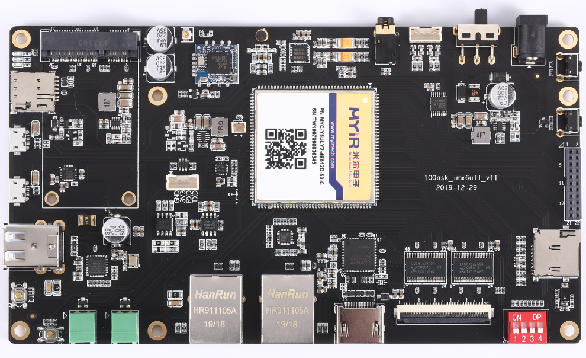
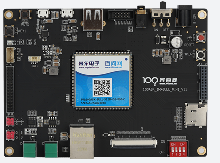
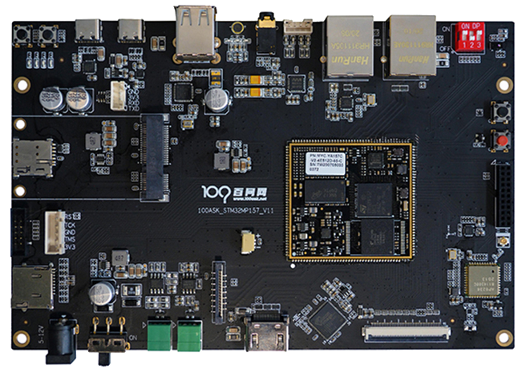
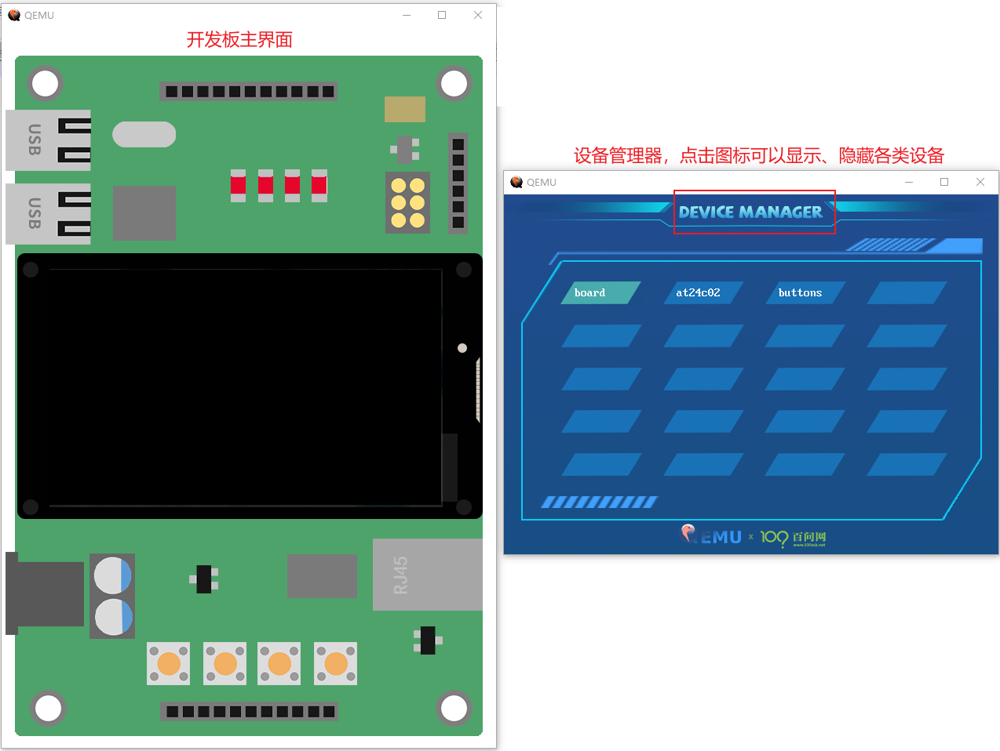

# OpenHarmony内核Liteos-a移植

## 1. 课程介绍

OpenHarmony内核Liteos-a，官方源码目前仅支持海思的几款芯片。

百问网把Liteo-a移植到2款芯片上：

* NXP公司的IMX6ULL
* ST公司是STM32MP157

对于IMX6ULL，我们所做的移植既支持真实的开发板，也支持QEMU。

目前只是移植了Liteos-a的最小系统，后续会继续移植GUI子系统等鸿蒙特性。


## 2. 资料下载及目录

本课程以视频为主，每一个视频都配有文档、源码。

视频放在B站(两个板子的视频大部分是类似的，在涉及单板本身的操作时有所不同)：

* IMX6ULL: https://www.bilibili.com/video/BV1Mf4y1a7PZ/
* STM32MP157: https://www.bilibili.com/video/BV1p5411M7HW/

文档放在GIT仓库，请使用如下GIT命令下载(无法在浏览器查看)：

```shell
git clone https://e.coding.net/weidongshan/openharmony/doc_and_source_for_openharmony.git
```

课程目录如下：

| 鸿蒙liteos-a最小系统移植  |                                                 |
| ------------------------- | ----------------------------------------------- |
| 01\_鸿蒙教程说明与资料下载 |                                                 |
|                           | 01\_鸿蒙教程说明与资料下载                       |
|                           | 02\_GIT下载演示\_鸿蒙体验(IMX6ULL)                |
|                           | 02\_GIT下载演示\_鸿蒙体验(STM32MP157)             |
|                           | 03\_下载源码\_阅读源码                            |
| 02\_移植概述               |                                                 |
|                           | 01\_移植鸿蒙要做的事                             |
|                           | 02\_必备基础知识                                 |
| 03\_Kconfig\_GCC\_Mkefile    |                                                 |
|                           | 01\_Kconfig介绍                                  |
|                           | 02\_准备工作\_安装windows\_gcc工具codeblocks和Make |
|                           | 03\_gcc编译过程详解                              |
|                           | 04\_Makefile的引入及规则                         |
|                           | 05\_Makefile的语法                               |
|                           | 06\_Makefile函数                                 |
|                           | 07\_Makefile实例                                 |
| 04\_Liteos-a的编译系统     |                                                 |
|                           | 01\_怎么编译子目录                               |
|                           | 02\_编译哪些子目录                               |
|                           | 03\_顶层Makefile分析                             |
| 05\_添加一个单板           |                                                 |
|                           | 01\_添加一个单板并编译                           |
|                           | 02\_解决链接错误                                 |
|                           | 03\_内核启动流程                                 |
| 06\_内存映射               |                                                 |
|                           | 01\_ARM架构内存映射简介                          |
|                           | 02\_内存映射代码分析                             |
|                           | 03\_内存映射内存编程\_IMX6ULL                     |
|                           | 03\_内存映射内存编程\_STM32MP157                  |
| 07\_串口移植               |                                                 |
|                           | 01\_Liteos-a中串口使用与驱动分层                 |
|                           | 02\_Liteos-a中串口驱动分离与硬件操作             |
|                           | 03\_串口移植\_IMX6ULL                             |
|                           | 03\_串口移植\_STM32MP157                          |
| 08\_系统时钟               |                                                 |
|                           | 01\_GenericTimer介绍                             |
|                           | 02\_GenericTimer源码分析                         |
| 09\_存储设备驱动程序       |                                                 |
|                           | 01\_存储设备驱动程序分析                         |
|                           | 02\_使用内存模拟Flash\_IMX6ULL                    |
|                           | 02\_使用内存模拟Flash\_STM32MP157                 |
| 10\_根文件系统             |                                                 |
|                           | 01\_根文件系统内容与制作                         |
|                           | 02\_正式版本的init进程                           |


## 3. 支持的真实开发板

本教程支持三款开发板：100ASK_IMX6ULL pro、100ASK_IMX6ULL mini emmc、100ASK_STM32MP157  pro。

单板的具体情况可以查看：http://100ask.taoboa.com

* 100ASK_IMX6ULL pro：全功能版




* 100ASK_IMX6ULL mini emmc

  


* 100ASK_STM32MP157  pro：全功能版

  


## 4. 支持的QEMU虚拟开发板

为方便大家体验Liteos-a，我们还制作了QEMU(模拟IMX6ULL)。

可以从这里下载：https://gitee.com/weidongshan/qemu_image_for_imx6ull/




## 5. 作者介绍

深圳百问网科技有限公司，韦东山，从事嵌入式软件培训10多年，涉及单片机、RTOS、Linux、Android。

官网：http://www.100ask.net

