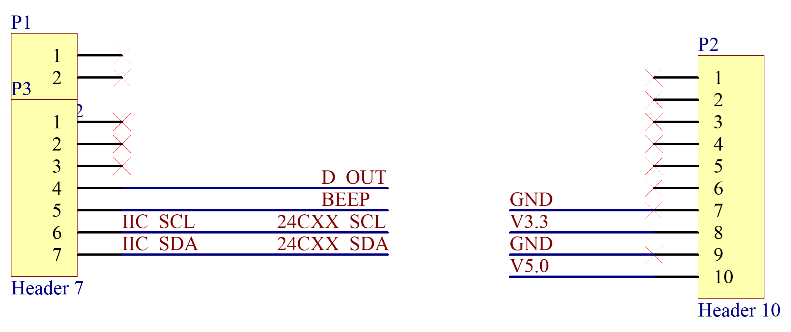

# BearPi-HM_Nano开发板传感器驱动开发——E53_IS1人体红外感应
本示例将演示如何在BearPi-HM_Nano开发板上使用E53_IS1实现人体红外感应，当检测到有人走动时，蜂鸣器发出报警。


## E53_IS1 API分析
本案例主要使用了以下API完成人体红外感应
## E53_IS1_Init()
```C
void E53_IS1_Init(void)
```
 **描述：**

初始化E53_IS1

## E53_IS1_Read_Data()
```C
void E53_IS1_Read_Data(E53_IS1_CallbackFunc func)
```
 **描述：**
设置人体感应触发的回调函数


## 硬件设计
本案例将用到 E53_IS1 红外感应扩展板与 BearPi-HM_Nano 开发板，其中E53_IS1扩展板原理图如下，当检测到人时，传感器会输出高电平，通过对GPIO_7的监测就能判断是否有人走动。




E53_IS1 红外感应扩展板与 BearPi-HM_Nano 开发板安装如下图所示


## 软件设计

**主要代码分析**


首先调用 `E53_IS1_Init()` 函数初始化E53_SC1所接的引脚的功能，然后调用 `E53_IS1_Read_Data()` 函数设置触发的回调函数Beep_Alarm(),系统启动后会通过osEventFlagsWait()函数让Example_Task任务一直等待事件标志位FLAGS_MSK1，当检测到人后，Beep_Alarm()函数会发送事件标志位，Example_Task任务继续运行开启蜂鸣器报警3秒钟 然后关闭蜂鸣器继续等待下一次触发事件。
```C
static void Beep_Alarm(char *arg)
{
    (void) arg;
    osEventFlagsSet(evt_id, FLAGS_MSK1);
}

static void Example_Task(void)
{
    E53_IS1_Init();
    E53_IS1_Read_Data(Beep_Alarm);
    while (1) 
    {
        osEventFlagsWait(evt_id, FLAGS_MSK1, osFlagsWaitAny, osWaitForever);
        Beep_StatusSet(ON);
        osDelay(300);
        Beep_StatusSet(OFF);

    }
}
```


## 编译调试

### 修改 BUILD.gn 文件
修改`applications\BearPi\BearPi-HM_Nano\sample`路径下 BUILD.gn 文件，指定 `e53_is1_example` 参与编译。
```r
#"C1_e53_sf1_mq2:e53_sf1_example",
#"C2_e53_ia1_temp_humi_pls:e53_ia1_example",
#"C3_e53_sc1_pls:e53_sc1_example",
#"C4_e53_sc2_axis:e53_sc2_example",
"C5_e53_is1_infrared:e53_is1_example",
```

    


### 运行结果<a name="section18115713118"></a>

示例代码编译烧录代码后，按下开发板的RESET按键，人员靠近开发板，蜂鸣器开始报警。


