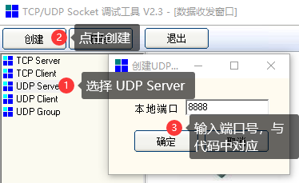
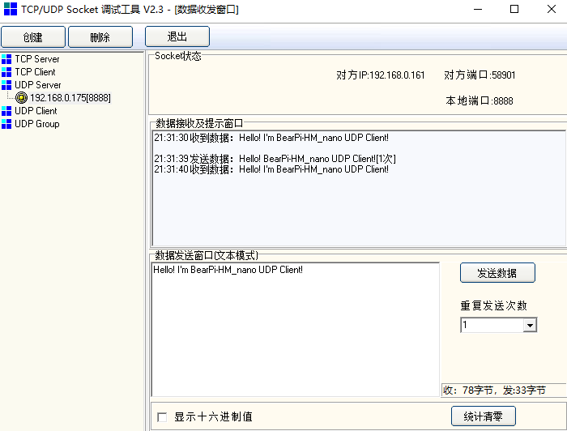

# BearPi-HM_Nano开发板WiFi编程开发——UDP客户端
本示例将演示如何在BearPi-HM_Nano开发板上使用socket编程创建UDP客户端，就收客户端消息并回复固定消息。


## socket API分析
本案例主要使用了以下几个API完socket编程实验
## socket()

```c
sock_fd = socket(AF_INET, SOCK_STREAM, 0)) //AF_INT:ipv4, SOCK_STREAM:tcp协议
```
**描述：**

在网络编程中所需要进行的第一件事情就是创建一个socket，无论是客户端还是服务器端，都需要创建一个socket，该函数返回socket文件描述符，类似于文件描述符。socket是一个结构体，被创建在内核中。
## sendto()
```c
int sendto ( socket s , const void * msg, int len, unsigned int flags,
const struct sockaddr * to , int tolen ) ;
```
**描述：**

sendto() 用来将数据由指定的socket传给对方主机。参数s为已建好连线的socket。参数msg指向欲连线的数据内容，参数flags 一般设0，

## recvfrom()
```c
int recvfrom(int s, void *buf, int len, unsigned int flags, struct sockaddr *from, int *fromlen);
```
**描述：**
从指定地址接收UDP数据报。


**参数：**

|名字|描述|
|:--|:------| 
| s | socket描述符.  |
| buf | UDP数据报缓存地址.  |
| len | UDP数据报长度.  |
| flags | 该参数一般为0.  |
| from | 对方地址  |
| fromlen | 对方地址长度.  |


## 软件设计

**主要代码分析**

完成Wifi热点的连接需要以下几步

1. 通过 `socket` 接口创建一个socket,`AF_INT`表示ipv4,`SOCK_STREAM`表示使用tcp协议
2. 调用 `sendto` 接口发送数据到服务端。
3. 调用 `recvfrom` 接口接收服务端发来的数据


```c
static void UDPClientTask(void)
{
	/* 服务器的地址信息 */
	struct sockaddr_in send_addr;
    char recvBuf[512];

    /* 连接Wifi */
    WifiConnect("TP-LINK_65A8","0987654321");

    /* 创建socket  */
	if((sock_fd = socket(AF_INET, SOCK_DGRAM, 0)) == -1)
	{
		perror("create socket failed!\r\n");
		exit(1);
	}

    /* 初始化预连接的服务端地址 */
    send_addr.sin_family = AF_INET;
    send_addr.sin_port = htons(_PROT_);
    send_addr.sin_addr.s_addr = inet_addr("192.168.0.175");

    while (1)
    {
        bzero(recvBuf,sizeof(recvBuf));
        /* 发送数据到服务端 */
        sendto(sock_fd, send_data, strlen(send_data), 0, (struct sockaddr * )&send_addr, addr_length);

        /* 线程休眠一段时间 */
        sleep(10);

        /* 接收服务端返回的字符串*/
        recvfrom(sock_fd, recvBuf, sizeof(recvBuf), 0, (struct sockaddr * )&send_addr, &addr_length);
        printf("%s:%d=>%s\n", inet_ntoa(send_addr.sin_addr), ntohs(send_addr.sin_port), recvBuf);
  
    }

    /* 关闭这个 socket */
    closesocket(sock_fd);

}
```

## 编译调试

### 修改 BUILD.gn 文件

修改 `applications\BearPi\BearPi-HM_Nano\sample` 路径下 BUILD.gn 文件，指定 `udp_client` 参与编译。
```r
#"D1_iot_wifi_sta:wifi_sta",
#"D2_iot_wifi_sta_connect:wifi_sta_connect",         
"D3_iot_udp_client:udp_client",
#"D4_iot_tcp_server:tcp_server",
#"D5_iot_mqtt:iot_mqtt",        
#"D6_iot_cloud_oc:oc_mqtt",
#"D7_iot_cloud_onenet:onenet_mqtt",
```  
    


### 运行结果<a name="section18115713118"></a>

使用 Socket tool 创建UDP服务端用于测试。



示例代码编译烧录代码后，按下开发板的RESET按键，在数据发送窗口输入要发送的数据，点击发送后开发板会回复固定消息，且开发板收到消息后会通过日志打印出来。

```
192.168.0.175:8888=>Hello! BearPi-HM_nano UDP Client!
```

